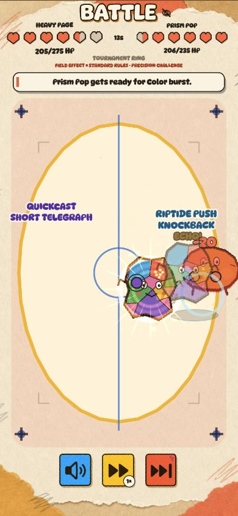

# Scribbits Arena

> Draw a creature. Its shape becomes its combat build. Tonight it fights.

Scribbits Arena is a portrait-first drawing and auto-battler game built for
Reddit with Devvit Web and Phaser. Players draw creatures called **Scribbits**
inside the Reddit post, watch those exact drawings come alive in short arena
fights, and return each day for community Rumbles, rival stories, rewards, and
new drawing themes.



## The game

Every official drawing receives the same 100-point stat budget. The server
analyzes the submitted PNG, chooses its permanent Combat Role, and resolves each
fight. The client then turns the stored result into a lively battle replay using
the player's actual art. Drawing choices create identity and matchups without
letting one player submit more raw stat power than another.

The main loop is:

1. Draw one official Scribbit for the current Community Theme.
2. Name it, choose one of three offered Power-Ups, and bring it to life.
3. Watch that exact drawing enter its first fight immediately.
4. Use Arena to Spar with rivals, pursue a Champion Contract, and make one
   nightly Rumble Pick.
5. Earn Ink, open Mystery Ink Chests, equip Gear, and care for growing
   Scribbits.
6. Return after the 00:00 UTC rollover for the Rumble result and continue the
   Scribbit's three-day growth story.

## How to play

### 1. Open the game

Open the Scribbits custom post on Reddit and enter the expanded game. The Home
screen shows the selected Scribbit and one large **DRAW!** action. The persistent
dock contains **Arena**, **Bag**, **Home**, **Battles**, and **Shop**.

### 2. Choose a drawing mode

The Draw screen offers two paths:

- **Community Theme** creates the official daily Scribbit. It can earn rewards,
  join the Rumble, appear in battle history, and eventually become a permanent
  Archived card.
- **Free Draw** is an untimed, once-per-Arena-day sketch. It uses the same canvas
  and tools but does not create a fighter, reward, Rumble entry, or battle
  record.

Community assignments come from an append-only calendar of shared three-day
themes. The current assignment remains locked until it is submitted, so every
Scribbit keeps an honest category for that cycle's community Rumble.

### 3. Draw a Scribbit

Draw with touch, mouse, or pen. The canvas provides twelve base colors, brush
size, eraser, undo, and an optional Tools drawer for unlocked paints, brushes,
stickers, clear, and redo. **NEXT** becomes available only after the shared
analyzer confirms that the drawing contains a real body rather than a tap-sized
mark.

The most-used role color determines the current Combat Role:

| Drawing colors          | Combat Role  | Battle style                             | Strong against |
| ----------------------- | ------------ | ---------------------------------------- | -------------- |
| Brown, coral, or orange | **Brawler**  | Close-range Ink Fists and Inkquake       | Mage           |
| Gold, green, or blue    | **Longshot** | Long-range Quill Launcher and Nib Volley | Brawler        |
| Aqua, purple, or pink   | **Mage**     | Ranged Palette Orb and Colorburst        | Longshot       |

Black, grey, and white are neutral. The counter loop is
**Brawler → Mage → Longshot → Brawler**. Size, outline, footprint, and color
variety still shape the normalized Chonk, Spike, Zip, and Charm values inside
the fixed 100-point build.

After drawing, name the Scribbit, confirm its preview, and choose one of three
server-offered Power-Ups. The birth reveal uses the submitted PNG itself—there
is no placeholder creature.

### 4. Watch the first fight

A new Scribbit immediately faces a server-selected founding rival. Scribbits is
not a turn-based or reflex PvP game: the server resolves the complete fight at a
fixed 20 Hz, stores the winner and transcript, and sends that immutable report
to Phaser for playback.

During the replay you can:

- mute or enable battle sound;
- watch at normal, 2×, or 4× speed;
- skip to the authoritative result; and
- share a completed, unskipped replay through Reddit's share flow.

Fights end within 20 seconds. At 15 seconds, **Sudden Scribble** shortens
Signature Move cooldowns for a fast finish. Replay effects, commentary, and
animation never alter the stored result.

### 5. Compete in Arena

Arena is the home for competition. Select a living Scribbit, review the current
season and venue challenge, then choose an activity:

- **Rival Run:** fight a three-bout run against founding rivals. Each slate
  offers **SAFE +1**, **EVEN +2**, and **BOLD +3** choices. A win adds the shown
  points; a loss still advances the run.
- **Founder Rival Thread:** build one best-of-three rivalry. At most one story
  beat advances per Arena day, while other fights remain replayable exhibitions.
- **Champion Contract:** challenge the current Champion once per day. A win
  awards +2 XP.
- **Practice Lab:** after the official drawing locks, make throwaway drawings
  to discover all three roles and immediately watch reward-free fights. Practice
  creates no Ink, XP, roster entry, Rumble entry, battle history, or Archived
  card.

The first Spar win of a UTC day awards +1 XP and +2 Ink. Gear can add bounded
techniques to direct exhibition fights, but Rumble, Champion, and Practice
remain Gear-neutral.

### 6. Make a nightly Rumble Pick

Every official Scribbit enters the asynchronous nightly Rumble automatically.
Before resolution, choose one other community contender as your daily Pick. The
choice locks on the server.

The nightly Devvit scheduler resolves the field at 00:00 UTC. Return afterward
to see the Champion, your Scribbit's result, and the last bout of your Pick when
available. Picking the Champion awards 3 permanent Clout; picking a finalist
awards 1.

### 7. Grow and collect

- **Ink:** the official daily draw awards 7 Ink, enough for one Mystery Ink
  Chest. Wins and daily returns can award more.
- **Shop:** each chest costs 7 Ink. Pulls use visible 70% Common, 25% Rare, 4%
  Epic, and 1% Legendary odds, with Epic-or-better guaranteed by pull 10. Open
  one chest or a maximum batch of ten.
- **Bag:** manage reusable Gear, permanent pens, titles, and discovered items.
  Tap a discovered consumable color to spend three Ink and add one use.
  Each living Scribbit has two slots in each Gear category: weapon, armor,
  shoes, and accessory. Duplicate Gear can be forged into higher ranks.
- **Care:** inspect a Scribbit and use its daily care actions during growth.
  Receipts show the exact server-confirmed mood, XP, and Ink changes.
- **Battles:** replay the newest 20 server-stored reports. Older result-only
  records remain readable even when motion replay is unavailable.
- **Gallery:** open Gallery from Home to browse Growing, Mature, and Archived
  Scribbits plus community Legends.

### 8. Mature and archive Scribbits

A Scribbit grows for three Arena days. It then becomes **Mature**: its base stats
lock, but it remains playable and can still use Gear. Each player has three
Growing slots and three Mature slots.

Retiring a Scribbit creates an immutable Archived card. If a fourth Scribbit
matures, the oldest Mature Scribbit is archived automatically. Archived cards
preserve the drawing, final level and record, Belief, equipment appearance, and
creator title. A crown or at least 25 community Belief gives the card a gold
Legend finish.

## Fairness and server authority

- All official drawings normalize to the same 100-point stat budget.
- Submitted images are revalidated by the Devvit server; the browser is never
  trusted as combat authority.
- Fight results, rewards, daily limits, Rumble Picks, progression, and inventory
  are server-owned and persisted in Redis.
- Battle replays render stored transcripts and cannot recalculate a winner.
- There is no paid currency. Mystery Ink is earned through play.
- Players can report Scribbits, delete owned Scribbits with confirmation, or
  delete all of their stored game data from the Field Guide.

## Technology

- **Platform:** Reddit Devvit Web
- **Client:** Phaser 4.2, TypeScript, Vite
- **Server:** Devvit Node.js runtime, Hono, managed Redis
- **Communication:** typed `/api/*` REST contracts
- **Rendering:** the submitted PNG becomes a deforming Phaser Inkbody during
  replay, with a Canvas-safe fallback

Production runs as a Devvit custom post. The inline `splash.html` entry stays
lightweight for the Reddit feed, while `game.html` contains the expanded Phaser
game. The server analyzes submissions, persists player state, schedules nightly
resolution, and returns deterministic reports.

## Repository layout

```text
scribbits/
├── app/                       Devvit application
│   ├── devvit.json            Devvit entrypoints, permissions, menus, scheduler
│   ├── src/client/            Phaser scenes and browser presentation
│   ├── src/server/            Hono routes and Redis-backed game logic
│   ├── src/shared/            Shared contracts, combat, analysis, and content
│   └── tests/                 Focused integration and regression suites
├── artifacts/                 Screenshots, submission media, and QA evidence
├── plans/                     Gameplay and implementation plans
├── DEPLOY.md                  Full deployment and troubleshooting guide
├── OVERVIEW.md                Product vocabulary and architecture source of truth
└── verify.command             Complete local verification entrypoint
```

## Local development

### Requirements

- Node.js 22.2.0 or newer
- pnpm 11.7.0
- A Reddit account and Devvit authentication for Reddit playtests or uploads

The root command files can locate common Homebrew, nvm, mise, asdf, and bundled
Codex runtimes, then install the locked dependencies when necessary.

### Browser-only preview

No Reddit login is required for the local mock:

```bash
./mock.command
```

Open <http://localhost:8902/>. The default preview starts with an empty roster;
add `?fixtures` to use seeded QA data. Client changes update through Vite, while
the mock backend keeps its last good build during a failed rebuild.

### Devvit playtest

Authenticate once from the app directory:

```bash
cd app
pnpm exec devvit login
cd ..
```

Then start a playtest in the configured `scribbits_dev` subreddit:

```bash
./playtest.command
```

You can target another subreddit with `./playtest.command subreddit_name`.

### Verify

Run the complete clean-shell gate from the repository root:

```bash
./verify.command
```

It runs TypeScript checks, ESLint, all discoverable Node test suites, the
deterministic combat simulation harness, and the production build. With Node and
pnpm already configured, the equivalent command is:

```bash
cd app
pnpm run verify
```

Useful focused commands from `app/` include:

```bash
pnpm run type-check
pnpm run lint
pnpm test
pnpm run test:sim
pnpm run build
pnpm run balance:check
```

## Deploying with Devvit

For a private patch upload, use the guarded root command:

```bash
./deploy.command
```

The command requires a clean worktree, runs the full verification gate, checks
Devvit authentication, and then executes a patch upload. It does not commit or
push changes. Combat balance simulation is optional; run
`pnpm run release:check:balance` from `app/` when combat or balance changes need
it.

To request public review instead, run:

```bash
cd app
pnpm run launch
```

That performs the standard release checks before `devvit publish --bump patch`.
See [DEPLOY.md](DEPLOY.md) for registration, GitHub auto-deploy, token setup, and
troubleshooting.

## More documentation

- [Product and architecture overview](OVERVIEW.md)
- [Devvit application notes](app/README.md)
- [Ranking season operations](app/docs/ranking-seasons.md)
- [Deployment guide](DEPLOY.md)
- [Submission package](SUBMISSION.md)
- [Devvit app configuration](app/devvit.json)

## License

The Devvit application is available under the BSD 3-Clause License. See
[app/LICENSE](app/LICENSE).
